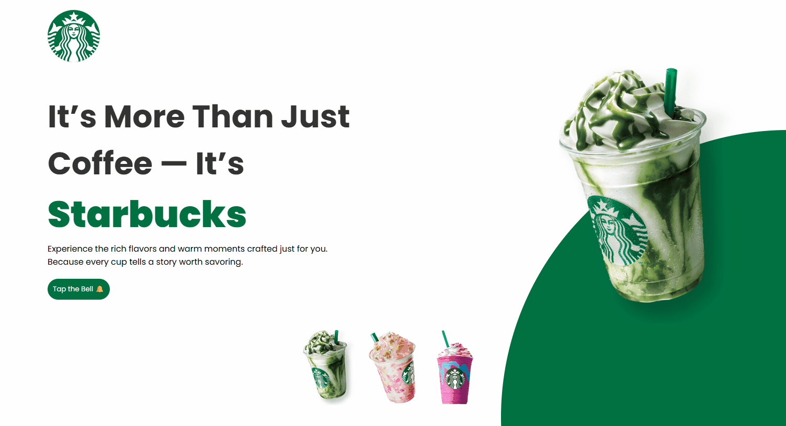

<h1 align="center"> Starbucks Inspired Landing Page ☕</h1> 

    A custom landing page inspired by the Starbucks aesthetic and branding. This project was developed as a personal challenge to practice modern layout structure, animations, and DOM interactions using only HTML, CSS, and JavaScript.</a>.

  
  <a href="#-screenshots">Screenshots</a>&nbsp;&nbsp;&nbsp;|&nbsp;&nbsp;&nbsp;
  <a href="#-technologies">Technologies</a>&nbsp;&nbsp;&nbsp;|&nbsp;&nbsp;&nbsp;
  <a href="#-project">Project</a>&nbsp;&nbsp;&nbsp;|&nbsp;&nbsp;&nbsp;
  <a href="#-certificate">Certificate</a>&nbsp;&nbsp;&nbsp;|&nbsp;&nbsp;&nbsp;
  <a href="#-license">License</a>&nbsp;&nbsp;&nbsp;|&nbsp;&nbsp;&nbsp;
  <a href="#-contributing">Contributing</a>&nbsp;&nbsp;&nbsp;|&nbsp;&nbsp;&nbsp;
  <a href="#support">Support</a>  

 

  

## 📸 Screenshots

 

## 🛠 Technologies

- HTML5  
- CSS3  
- JavaScript (Vanilla)  
- Google Fonts (Poppins)  
- Audio API  
- DOM manipulation  

 

## 💻 Project

This project simulates a Starbucks landing page with interactive elements. Clicking on each cup dynamically changes the main product image, background gradient, and theme color. 
It also includes a fun bell button with sound interaction.

The purpose was to practice:

- Clean HTML and CSS structure
- JavaScript interactivity
- Media handling with JavaScript
- Modern UI design inspired by real brands
  
 

## ✨ Features

- ✅ Dynamic cup selection with image and color changes  
- ✅ Audio playback when clicking the bell button  
- ✅ Responsive layout for different screen sizes  
- ✅ Stylish hover animations  
- ✅ Simple and clean UI  

 

## 📜 License

* This project is licensed under the [MIT License](https://choosealicense.com/licenses/mit/)

 

## 🫱🏻‍🫲🏻 Contributing

 Contributions, issues, and feature requests are welcome! Please, feel free to do it! 😉 

 

